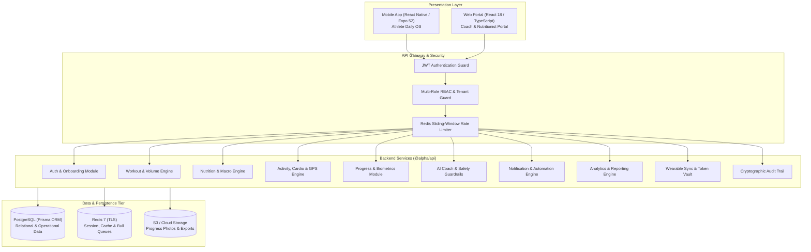

# ALPHA Performance OS

[]()
[-success.svg)]()
[]()
[]()
[]()
[]()
[]()
[]()

> **ALPHA Performance OS** is a production-grade, mobile-first personal performance and fitness platform engineered for structured workouts, nutrition adherence, cardio strain analysis, biometric tracking, and coach-managed performance programs.

---

## 1. Overview

ALPHA Performance OS delivers an end-to-end fitness and athletic operating system built upon modern cloud-native standards. The platform seamlessly connects athletes, trainers, nutritionists, and enterprise organizations through high-fidelity mobile and desktop experiences powered by a resilient, multi-tenant API gateway.

Key engineering pillars:
* **Mobile-First Client Experience**: React Native (Expo 52) with buttery smooth 60fps animations, offline resilience, and biometric security.
* **Coach & Trainer Desktop Portal**: React 18 / Stitch Dark Glass UI providing multi-client portfolio oversight, program builders, and adherence heatmaps.
* **High-Throughput Modular Backend**: NestJS 10 REST and WebSocket gateway backed by PostgreSQL, Prisma ORM, TimescaleDB metric time-series, and Redis caching.
* **Enterprise Security & Compliance**: AES-256-GCM token vault for wearable tokens, Scrypt password hashing, SHA-256 sequential audit hash-chaining, and GDPR Article 20 data portability compliance.

---

## 2. Platform Architecture



---

## 3. Core Capabilities

### 🏋️‍♂️ Workout & Volume Engine
* **Structured Workout Tracking**: Set-by-set logging (reps, weight, RPE, rest timers, and notes).
* **Exercise Taxonomy**: Comprehensive catalog categorized by muscle groups, movement patterns, and equipment.
* **Volume Analytics**: Real-time tonnage, intensity distribution, and automated 1RM calculation (Brzycki/Epley).
* **Plate Calculator & Barbell Presets**: Instant Olympic barbell plate breakdown.

### 🥗 Nutrition & Macro Engine
* **Target Management**: Caloric, macronutrient (protein, carbs, fat), and hydration daily goals.
* **Meal Logging**: Timestamped meal breakdowns with micronutrient and fiber tracking.
* **Adherence Engine**: Timezone-aware compliance scoring with weekly rolling trends.

### 🏃 Activity, Cardio & Strain
* **Cardio Session Tracking**: GPS route recording, pace calculation, elevation, and cadence.
* **Heart Rate Zones**: Automatic 5-zone HR breakdown and cardio strain scoring.
* **Location Privacy**: Haversine distance computations with automatic privacy-zone coordinate stripping for home/work locations.

### 📊 Progress, Biometrics & Analytics
* **Body Composition**: Weight, body fat percentage, skeletal muscle mass, and circumference measurements.
* **Progress Photo Vault**: Secure client-side uploads with short-lived presigned URLs ($\le 15\text{ min}$) and binary magic-byte validation.
* **Cohort Analytics & Reporting**: Athlete retention cohorts, coach portfolio KPIs, and deterministic CSV/PDF exports.

### 🤖 AI Coach & Safety Guardrails
* **Context Assembler**: Gathers recent biometric, workout, and nutritional history to formulate contextual coaching cues.
* **Prompt Injection Defense**: Sanitizes adversarial instruction overrides.
* **Mutation Guardrails**: Hardened requirement for explicit user confirmation before executing any plan modifications.

### ⌚ Wearables & Integrations
* **Multi-Provider Ingestion**: Native sync architectures for Apple HealthKit, Garmin Health, Oura Ring v2, and Whoop 4.0.
* **AES-256-GCM Token Vault**: Cryptographically authenticated token storage with unique 16-byte initialization vectors and authentication tags.
* **Webhook Defense**: HMAC-SHA256 signature verification with a 300s replay attack window.

### 🔒 Enterprise Security & Governance
* **Authentication**: Scrypt password hashing with high work factor, MFA TOTP, timing-safe equality checks, and 5-attempt brute-force account lockout.
* **Cryptographic Audit Chaining**: Sequential SHA-256 hash chaining from `GENESIS_AUDIT_HASH` for tamper-evident compliance logs.
* **Data Portability**: Full GDPR Article 20 JSON archive export verified with deterministic SHA-256 checksum manifests.

---

## 4. Monorepo Structure

```text
├── apps/
│   ├── api/          # NestJS 10 API Gateway & Domain Services
│   ├── mobile/       # React Native / Expo 52 Mobile Application
│   └── web/          # React 18 / TypeScript Coach & Trainer Web Portal
├── packages/
│   ├── database/     # Prisma Schema, Migrations & Database Client
│   ├── types/        # Shared TypeScript Interfaces, Enums & DTOs
│   ├── utils/        # Shared Utilities (Crypto, Date, Privacy, Formatting)
│   └── validation/   # Class-Validator / Class-Transformer Shared Schemas
├── infrastructure/
│   ├── docker/       # Docker Compose manifests (Postgres, Redis)
│   └── scripts/      # Local developer bootstrap scripts (dev-up, dev-down)
├── package.json      # Workspace root package manifest
└── tsconfig.base.json# Base TypeScript compiler configuration
```

---

## 5. Getting Started

### Prerequisites
* **Node.js**: `v20.x` or later
* **npm**: `v10.x` or later (Native npm workspaces)
* **Docker & Docker Compose** (for local PostgreSQL & Redis)

### Installation

1. **Clone the repository**:
   ```bash
   git clone https://github.com/gymapp08-droid/gymrecordapp.git
   cd gymrecordapp
   ```

2. **Install dependencies**:
   ```bash
   npm install
   ```

3. **Configure Environment Variables**:
   ```bash
   cp .env.example .env
   ```
   *Update `.env` with your local database, Redis, and JWT secrets.*

4. **Start Infrastructure Services**:
   ```bash
   docker-compose -f infrastructure/docker/docker-compose.yml up -d
   ```

5. **Generate Prisma Client & Run Migrations**:
   ```bash
   npm run prisma:generate
   npm run prisma:migrate
   ```

---

## 6. Running Applications

### Start Backend API
```bash
npm run start:dev --workspace=@alpha/api
# API listening at http://localhost:3000
```

### Start Coach Web Portal
```bash
npm run build --workspace=@alpha/web
# Launch portal in web server or development mode
```

### Start Mobile Application
```bash
npm run start --workspace=@alpha/mobile
# Scan QR code via Expo Go or run on iOS/Android simulator
```

---

## 7. Verification & Quality Gates

The repository includes a comprehensive, zero-mock automated test suite covering all 16 platform phases:

```bash
# Run all 42 automated test suites across the API
npm test --workspace=@alpha/api

# Compile all workspaces cleanly
npm run build
```

### Verified Test Matrix
| Scope | Test Suites | Passing Tests | Status |
| :--- | :---: | :---: | :---: |
| **Release Gate D (Production Launch)** | 1 | 14 / 14 | **PASS** |
| **Release Gate C (Security & Compliance)** | 1 | 17 / 17 | **PASS** |
| **Release Gate B (Core Journeys & RBAC)** | 1 | 16 / 16 | **PASS** |
| **Release Gate A (Infrastructure & Alerting)** | 1 | 15 / 15 | **PASS** |
| **Phase 15 Master QA & Hardening** | 4 | 80 / 80 | **PASS** |
| **Phases 01–14 Domain & Unit Suites** | 34 | 518 / 518 | **PASS** |
| **Total Automated Coverage** | **42 Suites** | **660 / 660** | **100% PASS** |

---

## 8. License

This project is licensed under the MIT License — see the [LICENSE](LICENSE) file for details.
